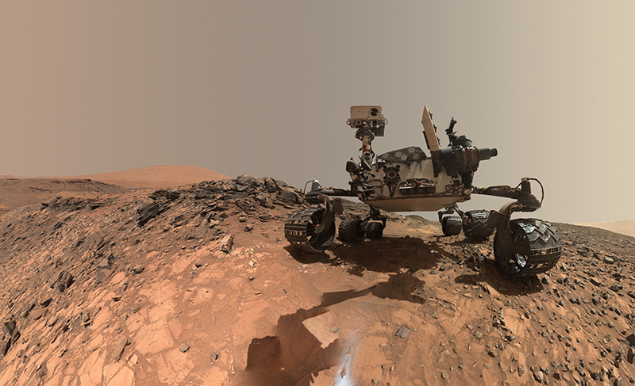

# Mars Rover Kata

You are working at Nasa in the team who's building Rover, an autonomous vehicle which explores Mars' surface.

## Mission

Develop an API that translates the commands sent from Earth into instructions understood by Rover and which sent back Rover's position.

However, communications between Earth and Mars are not 4G:

- a message arrives in between 3 minutes and 21 minutes
- the speed variates between 1,75 KB/s and 0,5 KB/s

The team in charge of communications created a very simple text protocol.

Be careful, as every adventure Mars' exploration will have share of surprises, be ready to adapt!

## Specifications

- Mars is represented by a 10x10 grid. Be careful, as every planet Mars is spherical.
- Mars has obstacle that blocks Rover
- The command sent are
  - `F` : Rover goes forward
  - `L` : Rover pivots to the left
  - `R` : Rover pivots to the right
- Rover receive several commands
- Rover sent its coordinate with the direction it is facing (`N`, `S`, `E`, `W`) in the following form `x:y:z`
- Rover is initially at coordinate `0:0:N`
- If Rover encounters an obstacle, it stops and sends its coordinate in the following form `O:x:y:z`

## Examples

**Rover receives empty command**

- Given Rover is in coordinate `0:0:N`
- When Rover receives ` `
- Then Rover sends the coordinate `0:0:N`

**Rover receives several commands**

- Given Rover is in coordinate `0:0:N`
- When Rover receives `FRF`
- Then Rover sends the coordinate `1:1:E`

**Rover encounters an obstacle**

- Given Rover is in coordinate `0:0:N` and there is an obstacle at position `1:1`
- When Rover receives `FRF`
- Then Rover sends the coordinate `O:0:1:E`

**Rover goes over grid limits**

- Given Rover is in coordinate `0:0:N` and Mars is represented by a 10x10 grid
- When Rover receives `RRF`
- Then Rover sends the coordinate `0:9:S`
